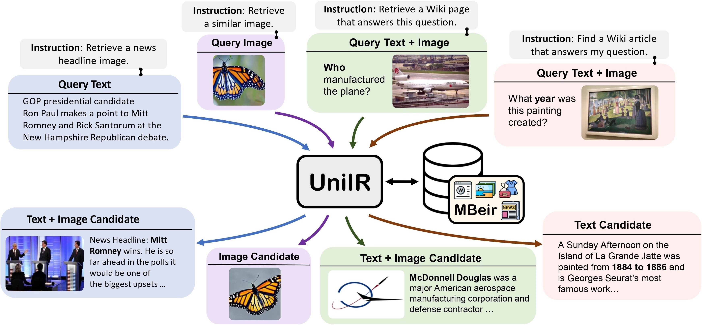

# UniIR

[**🌐 Homepage**](https://tiger-ai-lab.github.io/UniIR/) | [**🤗 Dataset(M-BEIR Benchmark)**](https://huggingface.co/datasets/TIGER-Lab/M-BEIR) | [**🤗 Checkpoints(UniIR models)**](https://huggingface.co/TIGER-Lab/UniIR) | [**📖 arXiv**](https://arxiv.org/pdf/2311.17136.pdf) | [**GitHub**](https://github.com/TIGER-AI-Lab/UniIR)

This repo contains the codebase for the ECCV-2024 paper "[UniIR: Training and Benchmarking Universal Multimodal
Information Retrievers](https://arxiv.org/pdf/2311.17136.pdf)"

## 🔔News
- **🔥[2024-04-13]**: We highlight another valuable and concurrent research on training instruction-following, multi-task multi-modal retrievers with Late-interaction:[PreFLMR: Scaling Up Fine-Grained Late-Interaction Multi-modal Retrievers](https://preflmr.github.io/) , which was done by the researchers of the University of Cambridge. They also introduced the M2KR benchmark which can be used to train and evaluate multi-modal universal information retrievers. We may combine the M2KR and M-BEIR benchmarks together to facilitate the advance of this field.
- **🔥[2024-03-18]: Release the UniIR(CLIP_SF) large and UniIR(BLIP_FF) large checkpoints [**🤗 Checkpoints**](https://huggingface.co/TIGER-Lab/UniIR)**
- **🔥[2023-12-21]: Our [🤗 M-BEIR Benchmark](https://huggingface.co/datasets/TIGER-Lab/M-BEIR) is now available for use.**


## Introduction
We propose the **UniIR**(Universal multimodal Information Retrieval) **framework** to learn a single retriever to accomplish (possibly) any retrieval task. Unlike traditional IR systems, UniIR needs to follow the instructions to take a heterogeneous query to retrieve from a heterogeneous candidate pool with millions of candidates in diverse modalities.




## Content

1. [M-BEIR](#M-BEIR)
2. [Training](#Training)
3. [Evaluation](#Evaluation)
2. [Model Zoo](#Model-Zoo)
4. [Citations and Contact](#Citation-and-Contact)


# M-BEIR
To train and evaluate universal multimodal retrieval models, we build a large-scale retrieval benchmark named **M-BEIR** (Multimodal BEnchmark for Instructed Retrieval).

## M-BEIR Downloading
We provide the M-BEIR dataset in the [**🤗 Dataset**](https://huggingface.co/datasets/TIGER-Lab/M-BEIR).
**Please follow the instructions provided on the HF page** to download the dataset and prepare the data for training and evaluation.
You need to set up GiT LFS and directly clone the repo:
```
git clone https://huggingface.co/datasets/TIGER-Lab/M-BEIR
```

# UniIR Models
We provide the codebase for training and evaluating the UniIR CLIP-ScoreFusion, CLIP-FeatureFusion, BLIP-ScoreFusion, and BLIP-FeatureFusion models.

## Environment
Prepare the codebase of the UniIR project and Conda environment using the following commands:
```bash
git clone https://github.com/TIGER-AI-Lab/UniIR
cd UniIR

cd src/models/
conda env create -f uniir_env.yml
```

## Training
To train the UniIR models from pretrained CLIP and BLIP checkpoints, please follow the instructions below. 
The scripts will automatically download the pretrained CLIP and BLIP checkpoints.

### 1. Download the M-BEIR Benchmark
Please download the M-BEIR benchmark by following the instructions in the [**M-BEIR**](#M-BEIR) section.

### 2. Scripts
#### To train UniIR CLIP_SF Large with the default configuration:
```bash
cd src/models/uniir_clip/clip_scorefusion/configs_scripts/large/train/inbatch/
```
Modify `inbatch.yaml` for hyperparameter tuning and `run_inbatch.sh` for your own environment and paths.

#### Note:
1. Modify the ```UNIIR_DIR``` in the `run_inbatch.sh` to the directory where you
want to store the checkpoints.
2. Modify the ```MBEIR_DATA_DIR``` in the `run_inbatch.sh` to the directory where you store the M-BEIR benchmark.
3. Modify the ```SRC_DIR``` in the `run_inbatch.sh` to the directory where you store the codebase of the UniIR project(This repo).
4. By default, UniIR models are trained on M-BEIR with in-batch negatives, and the hard negatives provided by the original datasets 
are not used.
5. We used wandb to log the training process. Please make sure a `.env` environment with `WANDB_API_KEY`, `WANDB_PROJECT`, and `WANDB_ENTITY`  is set. 

Then you can run the following command to train the UniIR CLIP_SF Large model.
```bash
bash run_inbatch.sh
```

#### To train UniIR BLIP_FF Large with the default configuration:
```bash
cd src/models/uniir_blip/blip_featurefusion/configs_scripts/large/train/inbatch/
```
Modify `inbatch.yaml` for hyperparameter tuning and `run_inbatch.sh` for your own environment and paths.
```bash
bash run_inbatch.sh
```

#### Similarly, you can train the UniIR CLIP_FF and BLIP_SF models by modifying the corresponding scripts.

## Evaluation
We provide the evaluation pipeline for the UniIR models on the M-BEIR benchmark.
### 1. Environment
Please create an environment for the FAISS library:
```bash
# From the root directory of the project
cd src/common/
conda env create -f faiss_env.yml
```

### 2. Download the M-BEIR Benchmark
Please download the M-BEIR benchmark by following the instructions in the [**M-BEIR**](#M-BEIR) section.

### 3. Download the UniIR Checkpoints
You can train the UniIR models from scratch or download the pre-trained UniIR checkpoints by following the instructions in the [**Model Zoo**](#Model-Zoo) section.

### 4. Scripts
#### To evaluate UniIR CLIP_SF Large with the default configuration:
```bash
cd src/models/uniir_clip/clip_scorefusion/configs_scripts/large/eval/inbatch/
```
Modify `embed.yaml`, `index.yaml`, `retrieval.yaml` and `run_eval_pipeline_inbatch.sh` for your own environment, paths and evaluation settings.

#### Note:
1. If you download our pretrained UniIR model, please modify the ```UNIIR_DIR``` in the `run_eval_pipeline_inbatch.sh` to the directory where you
want to store large files including the checkpoints, embeddings, index and retrieval results.
Then you can place the ```clip_sf_large.pth``` file in the following path:
    ```bash
    $UNIIR_DIR/checkpoint/CLIP_SF/Large/Instruct/InBatch/clip_sf_large.pth
    ```
    This the default path specified by ```model.ckpt_config``` in the `embed.yaml` file.
2. Modify the ```MBEIR_DATA_DIR``` in the `run_eval_pipeline_inbatch.sh` to the directory where you store the M-BEIR benchmark.
3. Modify the ```SRC_DIR``` in the `run_eval_pipeline_inbatch.sh` to the directory where you store the codebase of the UniIR project(This repo).

The default configuration will evaluate the UniIR CLIP_SF Large model on  both the M-BEIR (5.6M heterogeneous candidate pool) and the M-BEIR_local (homogeneous candidate pool) benchmarks.
```UNION``` in the yaml files refers to the M-BEIR (5.6M heterogeneous candidate pool).
You can follow the comments in the yaml files and modify the configurations to evaluate the model on the M-BEIR_local benchmark only.
```bash
bash run_eval_pipeline_inbatch.sh
```
```embed```, ```index```, ```logger``` and ```retrieval_results``` will be saved in the ```$UNIIR_DIR``` directory.

#### To evaluate UniIR BLIP_FF Large with the default configuration:
```bash
cd src/models/unii_blip/blip_featurefusion/configs_scripts/large/eval/inbatch/
```
Similarly, if you download our pretrained UniIR model, you can place the ```blip_ff_large.pth``` file in the following path:
```bash
$UNIIR_DIR/checkpoint/BLIP_FF/Large/Instruct/InBatch/blip_ff_large.pth
```

The default configuration will evaluate the UniIR BLIP_FF Large model on both the M-BEIR and the M-BEIR_local benchmarks.
```bash
bash run_eval_pipeline_inbatch.sh
```
#### You can train and evaluate the UniIR CLIP_FF and BLIP_SF models by modifying the corresponding scripts.

## Model Zoo
We provide the UniIR model checkpoints in the [**🤗 Checkpoints**](https://huggingface.co/TIGER-Lab/UniIR).
You can directly use the checkpoints for retrieval tasks or fine-tune the models for your own retrieval tasks.

### Available Checkpoints

| Model Name     | Version | Model Size | Model Link                                                                                             |
|----------------|---------|------------|--------------------------------------------------------------------------------------------------------|
| UniIR(CLIP-SF) | Large   | 5.13 GB    | [Download Link](https://huggingface.co/TIGER-Lab/UniIR/blob/main/checkpoint/CLIP_SF/clip_sf_large.pth) |
| UniIR(BLIP-FF) | Large   | 7.49 GB    | [Download Link](https://huggingface.co/TIGER-Lab/UniIR/blob/main/checkpoint/BLIP_FF/blip_ff_large.pth) |

You can download them by 
```
git clone https://huggingface.co/TIGER-Lab/UniIR
```


## Citation and Contact
- Cong Wei: c58wei@uwaterloo.ca
- Yang Chen: yangc@gatech.edu
- Alan Ritter: alan.ritter@cc.gatech.edu
- Wenhu Chen: wenhuchen@uwaterloo.ca


**BibTeX:**
```bibtex
@article{wei2023uniir,
  title={Uniir: Training and benchmarking universal multimodal information retrievers},
  author={Wei, Cong and Chen, Yang and Chen, Haonan and Hu, Hexiang and Zhang, Ge and Fu, Jie and Ritter, Alan and Chen, Wenhu},
  journal={arXiv preprint arXiv:2311.17136},
  year={2023}
}
```
